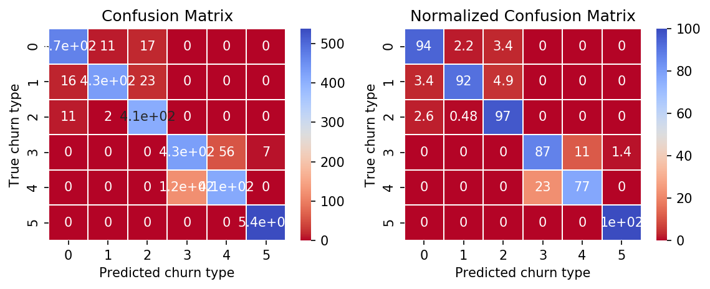

# Human Activity Classification

This is a script that predicts whether or not a human is doing one of 6 activities that is tracked by a user's smartphone. Data for the [Human Activity Recognition Using Smartphones Data Set](https://archive.ics.uci.edu/ml/datasets/human+activity+recognition+using+smartphones) is hosted at the Center for Machine Learning and Intelligent Systems at the University of California, Irvine.

## Getting Started

These instructions will get you a copy of the project up and running on your local machine for development and testing purposes.

### Prerequisites

This project requires a base installation of Python 3.5, h5py, numpy, karas, tensorflow, sklearn, matplotlib, and seaborn.

Download the data [here](https://archive.ics.uci.edu/ml/machine-learning-databases/00240/UCI%20HAR%20Dataset.zip) and unzip it in your working directory.

## How to Run

To run the code in your terminal, navigate to your working directory, then type

```
python train_from_file.py
```

## Expected results

Expected training accuracy is about 95% and test accuracy is approximately 92%.

In the plots/ directory, the following image of confusion matrix from the test data and predicted data should appear:




## Authors

* **Jason Boulet** - *Initial work* - [far-from-normal](https://github.com/far-from-normal)


## License

This project is licensed under the MIT License.